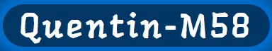

<h1 align="center">
  PROJET 12 
 Quentin-M58 
   
  
        
  
</h1>
<h2 align="center">DESCRIPTION</h2>
<h3 style="vertical-align: middle;">Projet réalisée lors de la formation d'integrateur Web d'
  
  . Ce projet permet la création de son propre portfolio. 
</h3>
<h2 align="center">INFORMATION</h2>
<h3>Effectuer les opérations suivantes pour les deux dossier.Pour pouvoir faire fonctionner le site, télécharger le, puis executer la commande npm install dans le dossier du site et une fois installer executer npm start pour mettre le site en fonctionement.</h3>
<table align="center" width=100% >
<caption>
    <h2 align="center">CONTENU</h2>
  </caption>
  <thead>
    <tr>
      <th style="text-align:center;">DOSSIER</th>
      <th style="text-align:center;">EXPLICATION</th>
    </tr>
  </thead>
  <tbody>
    <tr>
      <th style="text-align:center;">
    </th>
      <th style="text-align:center;">CONTIENT LE CODE FRONT-END DU SITE</th>
    </tr>
  </tbody>
</table>  

